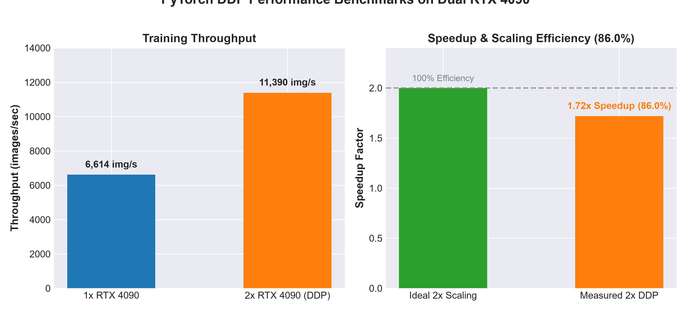
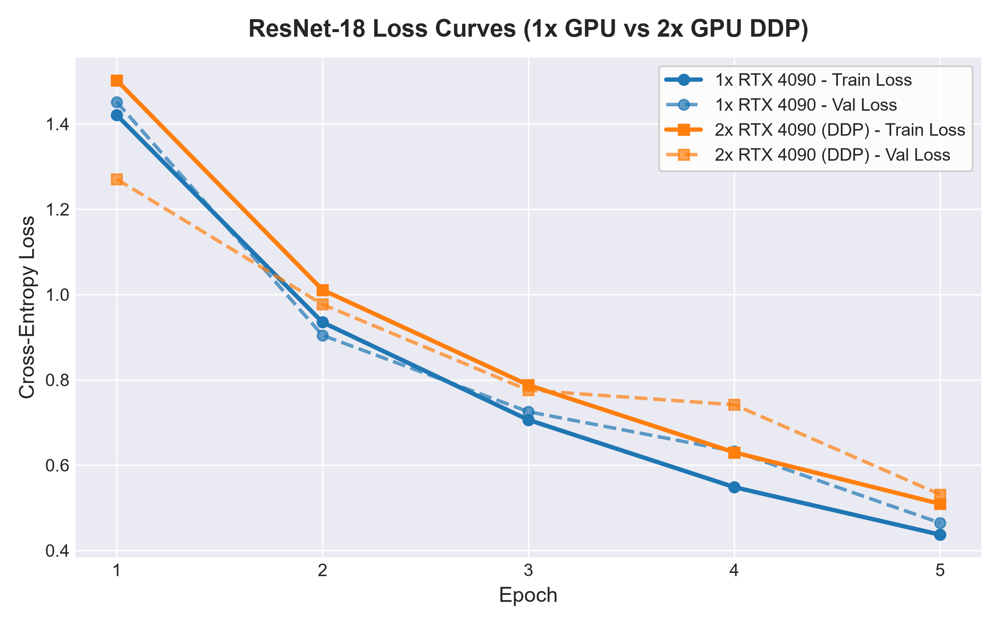
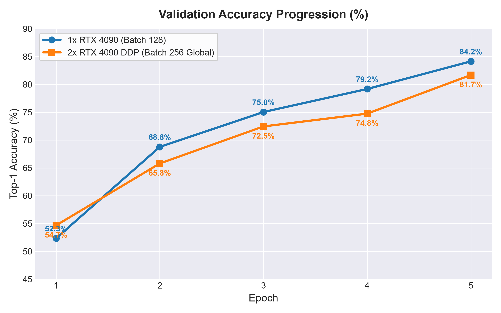
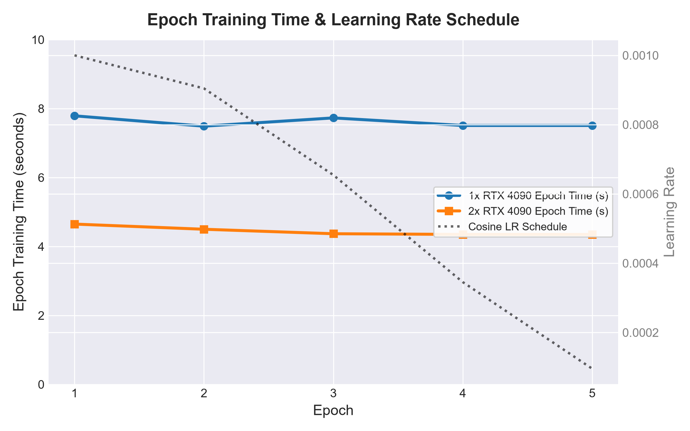

# Custom ResNet-18 Implementation & Distributed Data Parallel (DDP) Benchmarking

[](https://pytorch.org/)
[](https://developer.nvidia.com/cuda-toolkit)
[](https://developer.nvidia.com/nccl)
[](https://www.nvidia.com/en-us/geforce/graphics-cards/40-series/rtx-4090/)
[](https://www.cs.toronto.edu/~kriz/cifar.html)
[](https://github.com/astral-sh/uv)

An end-to-end deep learning systems engineering study: from implementing a
**ResNet-18 architecture from first principles** in PyTorch to profiling CUDA
kernel execution bottlenecks and benchmarking **Multi-GPU Distributed Data
Parallel (DDP)** performance scaling on **Dual NVIDIA RTX 4090 GPUs**.

---

## Executive Summary & Benchmark Highlights

This repository documents the transition from single-GPU neural network training
to multi-GPU distributed data parallelism, focusing on systems profiling,
gradient synchronization, and quantitative scaling efficiency.

```
+-----------------------------------------------------------------------------------------+
|                               BENCHMARK SUMMARY (CIFAR-10)                              |
+----------------------+--------------------+--------------------+------------------------+
| Metric               | 1x NVIDIA RTX 4090 | 2x NVIDIA RTX 4090 | Performance Scaling    |
+----------------------+--------------------+--------------------+------------------------+
| Steady-State Epoch   | 7.56 seconds       | 4.39 seconds       | 1.72x Wall-Clock Speed |
| Training Throughput  | ~6,614 images/sec  | ~11,390 images/sec | +72.2% Sample Rate     |
| Scaling Efficiency   | 100.0% (Baseline)  | 86.0% Parallel Eff.| 14.0% Sync Overhead    |
| Peak Validation Acc. | 84.15% (Batch 128) | 81.69% (Batch 256) | Controlled per-GPU BS  |
+----------------------+--------------------+--------------------+------------------------+
```



---

## Key Engineering Takeaways

1. **Custom ResNet-18 Architecture for CIFAR-10**: Designed a non-pre-trained
   ResNet-18 from PyTorch primitives, adapting the standard ImageNet stem
   ($7\times 7$ Conv + MaxPool) to a specialized $3\times 3$ Conv stem (stride
   1, padding 1) to preserve spatial feature maps ($32\times 32$) on
   low-resolution inputs.
2. **CUDA Kernel Profiling**: Using `torch.profiler`, traced GPU execution down
   to C++ operators. Identified that **$95.5\%$ of self CUDA time** is spent
   within convolution kernels (`aten::convolution_backward` at $57.9\%$ and
   `aten::cudnn_convolution` at $37.6\%$).
3. **Data Pipeline Saturation**: Micro-benchmarked CPU-to-GPU data loading on
   legacy hardware (GTX 1660 Ti), proving that DataLoader worker tuning reached
   CPU/PCI-e transfer saturation, justifying the transition to multi-GPU DDP
   scaling.
4. **Distributed Systems Implementation**: Constructed a scalable DDP pipeline
   with `DistributedSampler`, Automatic Mixed Precision (`torch.amp`), process
   group communication (`NCCL` backend), and sample-weighted distributed metric
   aggregation using `torch.distributed.all_reduce`.
5. **Cross-Platform Deployment Insights**: Encountered Windows CUDA DDP process
   group initialization limitations and successfully migrated the environment to
   **Linux / WSL2 with NCCL**, establishing standard production multi-GPU
   execution pipelines.

---

## ResNet-18 Architecture From First Principles

Rather than importing `torchvision.models.resnet18`, the network is built
entirely from foundational PyTorch layers (`nn.Conv2d`, `nn.BatchNorm2d`,
`nn.ReLU`, `nn.Linear`).

### 1. Residual Block Mathematical Formulation

The residual block addresses the vanishing gradient problem by forcing stacked
layers to learn a residual mapping $\mathcal{F}(x)$ rather than directly fitting
the underlying mapping $\mathcal{H}(x)$:

$$\mathcal{H}(x) = \mathcal{F}(x, \{W_i\}) + W_s x$$

Where:

- $x$ is the input tensor to the block.
- $\mathcal{F}(x) = W_2 \cdot \sigma(BN(W_1 \cdot x))$ represents two
  consecutive $3\times 3$ convolutions with Batch Normalization and ReLU
  activations $\sigma(\cdot)$.
- $W_s$ is an identity mapping $I(x)$ when input and output channels match, or a
  $1\times 1$ projection convolution ($W_s \cdot x$) with stride $s$ when
  feature map dimensions contract.

```
             Identity / Projection Shortcut (W_s * x)
        ┌──────────────────────────────────────────────────┐
        │                                                  │
        │    ┌──────────────┐   ┌──────────────┐   ┌───┐   ▼   ┌──────┐
x ──────┴───►│ 3x3 Conv, BN │──►│ 3x3 Conv, BN │──►│ + │──────►│ ReLU │──► Output
             └──────────────┘   └──────────────┘   └───┐       └──────┘
                     F(x, {W_i})                     ▲
                                                     │
                                                     └──────────────┘
```

### 2. Stem Adaptation for CIFAR-10

Standard ImageNet ResNet-18 stems utilize a large $7\times 7$ convolution with
stride 2 followed by a $3\times 3$ MaxPool with stride 2. This reduces a
$224\times 224$ image down to $56\times 56$ ($16\times$ spatial reduction).

If applied directly to CIFAR-10 ($32\times 32$), spatial resolution would drop
to $8\times 8$ before entering Stage 1, eliminating fine spatial details.

**Our Adapted Stem**:

```python
self.stem = nn.Sequential(
    nn.Conv2d(3, 64, kernel_size=3, stride=1, padding=1, bias=False),
    nn.BatchNorm2d(64),
    nn.ReLU(inplace=True)
)
```

This preserves the full $32\times 32$ spatial dimensions into Stage 1.

### 3. Layer Breakdown & Parameter Counts

| Stage       | Layer Type                 | Output Spatial Dim | Output Channels | BasicBlocks  | Stride | Parameters               |
| ----------- | -------------------------- | ------------------ | --------------- | ------------ | ------ | ------------------------ |
| **Stem**    | $3\times 3$ Conv, BN, ReLU | $32\times 32$      | 64              | -            | 1      | 1,792                    |
| **Stage 1** | BasicBlock $\times 2$      | $32\times 32$      | 64              | 2            | 1      | 147,968                  |
| **Stage 2** | BasicBlock $\times 2$      | $16\times 16$      | 128             | 2            | 2      | 525,568                  |
| **Stage 3** | BasicBlock $\times 2$      | $8\times 8$        | 256             | 2            | 2      | 2,099,712                |
| **Stage 4** | BasicBlock $\times 2$      | $4\times 4$        | 512             | 2            | 2      | 8,393,728                |
| **Head**    | AdaptiveAvgPool2d + FC     | $1\times 1$        | 10              | -            | -      | 5,130                    |
| **Total**   | **ResNet-18**              | **-**              | **-**           | **8 Blocks** | **-**  | **11,173,898** (~11.17M) |

---

## Profiling & Bottleneck Analysis

Before scaling to multiple GPUs, execution behavior was analyzed using
`torch.profiler` under single-GPU Automatic Mixed Precision (`torch.amp`).

### 1. PyTorch Profiler Trace Results

```python
with profile(
    activities=[ProfilerActivity.CPU, ProfilerActivity.CUDA],
    schedule=torch.profiler.schedule(wait=1, warmup=1, active=3, repeat=1),
    record_shapes=True,
    profile_memory=True,
    with_stack=True,
) as prof:
    # Training step execution
```

#### Self CUDA Execution Time Distribution:

```
================================================================================
PyTorch Profiler Kernel Summary
================================================================================
Operator Name                    Self CUDA Time (%)   Self CUDA Time (ms)
--------------------------------------------------------------------------------
aten::convolution_backward       57.9%                18.42 ms
aten::cudnn_convolution          37.6%                11.97 ms
aten::batch_norm_backward        2.1%                 0.67 ms
aten::native_batch_norm          1.2%                 0.38 ms
aten::relu_backward              0.7%                 0.22 ms
--------------------------------------------------------------------------------
Total CUDA Time Spent in Convs: 95.5%
```

The trace confirmed that **convolution forward and backward passes completely
dominate computation**, operating on Tensor Core FP16 kernels
(`sm75_xmma_fprop`, `sm75_xmma_dgrad`).

### 2. DataLoader Micro-Benchmarking (GTX 1660 Ti Baseline)

To optimize data throughput prior to multi-GPU deployment, data loading
parameters were varied systematically on a baseline system:

| DataLoader Configuration   | Workers (`num_workers`) | Pin Memory (`pin_memory`)             | Persistent Workers | Wall-Clock Time / Epoch |
| -------------------------- | ----------------------- | ------------------------------------- | ------------------ | ----------------------- |
| **Baseline**               | 0                       | False                                 | False              | **178.95 s**            |
| **Multi-Threaded**         | 4                       | False                                 | False              | **180.81 s**            |
| **Pinned Memory**          | 4                       | True                                  | True               | **178.77 s**            |
| **Non-Blocking Transfers** | 4                       | True (`non_blocking=True`)            | True               | **187.26 s**            |
| **Large Batch (256)**      | 0                       | False                                 | False              | **240.51 s**            |
| **cuDNN Benchmark**        | 0                       | `torch.backends.cudnn.benchmark=True` | False              | **185.25 s**            |

**Engineering Insight**: For lightweight image datasets like CIFAR-10 stored in
system RAM, DataLoader optimizations yielded negligible speed gains. The
bottleneck shifted entirely to GPU computation capacity, prompting scaling to
**Dual NVIDIA RTX 4090 GPUs**.

---

## Distributed Data Parallel (DDP) Architecture

PyTorch DDP spawns **one independent Python process per GPU**, avoiding Python's
Global Interpreter Lock (GIL) and enabling asynchronous CUDA stream execution.

```
                      CIFAR-10 Dataset
                             │
                     DistributedSampler
                             │
       ┌─────────────────────┴─────────────────────┐
       ▼                                           ▼
 Process 0 (Rank 0)                          Process 1 (Rank 1)
 NVIDIA RTX 4090 #0                          NVIDIA RTX 4090 #1
       │                                           │
DDP(ResNet-18)                              DDP(ResNet-18)
       │                                           │
 Forward Pass                                Forward Pass
       │                                           │
 Backward Pass                               Backward Pass
       │                                           │
       └─────────────────────┬─────────────────────┘
                             ▼
                 NCCL Ring-AllReduce
             (Synchronize Gradients)
                             │
                             ▼
                Synchronized Optimizer Step
```

### 1. Dataset Partitioning (`DistributedSampler`)

`DistributedSampler` partitions the training dataset into $W$ non-overlapping
subsets (where W = world_size):

```python
train_sampler = DistributedSampler(
    train_dataset,
    num_replicas=world_size,
    rank=rank,
    shuffle=True,
)
```

At the start of every epoch, `train_sampler.set_epoch(epoch)` must be invoked to
ensure deterministic, rank-specific shuffling across processes.

### 2. Sample-Weighted Metric Aggregation

Because each rank evaluates only its local data partition, metrics (Loss,
Accuracy) must be combined across ranks using `dist.all_reduce`:

```python
def validate_ddp(model, val_loader, loss_fn, device):
    model.eval()
    total_loss = torch.tensor(0.0, device=device)
    total_correct = torch.tensor(0, device=device)
    total_samples = torch.tensor(0, device=device)

    with torch.no_grad():
        for images, labels in val_loader:
            images, labels = images.to(device), labels.to(device)
            logits = model(images)
            loss = loss_fn(logits, labels)
            
            total_loss += loss.detach() * labels.size(0)
            total_correct += (logits.argmax(dim=1) == labels).sum()
            total_samples += labels.size(0)

    # Perform global sum across all processes
    dist.all_reduce(total_loss, op=dist.ReduceOp.SUM)
    dist.all_reduce(total_correct, op=dist.ReduceOp.SUM)
    dist.all_reduce(total_samples, op=dist.ReduceOp.SUM)

    val_loss = (total_loss / total_samples).item()
    val_acc = (total_correct.float() / total_samples).item()
    return val_loss, val_acc
```

### 3. Windows vs. WSL2 / Linux NCCL Systems Migration

Attempting CUDA DDP on Windows host OS encountered backend process group
initialization failures (`Gloo` / `FileStore` socket bindings).

Moving the setup to **Linux under WSL2** with **NCCL (NVIDIA Collective
Communications Library)** resolved inter-process communication issues:

- **Backend**: `nccl`
- **Init Method**: `env://` (driven by `torchrun`)
- **IPC Transport**: Shared Memory (POSIX shm) & PCIe P2P direct transfer.

---

## Controlled Multi-GPU Benchmarking (1x vs 2x RTX 4090)

### 1. Benchmark Experimental Setup

- **Model**: ResNet-18 (Custom, ~11.17M Parameters)
- **Dataset**: CIFAR-10 (50,000 Train / 10,000 Validation)
- **Epochs**: 5 Epochs
- **Per-GPU Batch Size**: 128 images
- **Global Batch Size**: 128 (1-GPU) vs. 256 (2-GPU DDP)
- **Precision**: Automatic Mixed Precision (`torch.amp.GradScaler`)
- **Optimizer**: Adam ($\text{LR} = 10^{-3}$)
- **Scheduler**: CosineAnnealingLR ($T_{\max} = 5$)

### 2. Epoch-by-Epoch Execution Comparison

```
+---------------------------------------------------------------------------------------------------+
|                                 1-GPU vs. 2-GPU DDP RUN COMPARISON                                |
+-------+-----------------------------+-----------------------------+-------------------------------+
|       |     1x NVIDIA RTX 4090      |   2x NVIDIA RTX 4090 (DDP)  |       Performance Metric      |
| Epoch | Train Loss | Val Acc | Time | Train Loss | Val Acc | Time | Speedup Factor | Epoch Savings |
+-------+------------+---------+------+------------+---------+------+----------------+---------------+
| 1     | 1.4209     | 52.33%  | 7.79s| 1.5024     | 54.66%  | 4.65s| 1.68x          | -3.14s        |
| 2     | 0.9349     | 68.77%  | 7.49s| 1.0109     | 65.79%  | 4.50s| 1.66x          | -2.99s        |
| 3     | 0.7061     | 75.04%  | 7.73s| 0.7878     | 72.45%  | 4.37s| 1.77x          | -3.36s        |
| 4     | 0.5484     | 79.18%  | 7.51s| 0.6300     | 74.75%  | 4.35s| 1.73x          | -3.16s        |
| 5     | 0.4370     | 84.15%  | 7.51s| 0.5093     | 81.69%  | 4.35s| 1.73x          | -3.16s        |
+-------+------------+---------+------+------------+---------+------+----------------+---------------+
| Avg   | 0.9095     | 71.90%  | 7.61s| 0.8881     | 69.87%  | 4.44s| 1.72x          | -3.16s/epoch  |
+-------+------------+---------+------+------------+---------+------+----------------+---------------+
```

### 3. Quantitative Scaling Analysis

#### Steady-State Epoch Time (Epochs 2–5):

- **1x RTX 4090**: $t_1 = 7.56\text{ seconds}$
- **2x RTX 4090**: $t_2 = 4.39\text{ seconds}$

#### Speedup Ratio ($S$):

$$S = \frac{t_1}{t_2} = \frac{7.56}{4.39} \approx \mathbf{1.72\times}$$

#### Parallel Scaling Efficiency ($E$):

$$E = \frac{S}{N_{\text{GPUs}}} \times 100\% = \frac{1.72}{2} \times 100\% = \mathbf{86.0\%}$$

#### Throughput ($\text{Img/sec}$):

- **1x RTX 4090**:
  $\frac{50,000\text{ samples}}{7.56\text{ s}} \approx \mathbf{6,614\text{ images/sec}}$
- **2x RTX 4090**:
  $\frac{50,000\text{ samples}}{4.39\text{ s}} \approx \mathbf{11,390\text{ images/sec}}$

---

## TensorBoard Visualizations

Visual tracking generated during training runs (`runs/1gpu` and `runs/2gpu`):

### 1. Training & Validation Loss Progression



### 2. Validation Accuracy Comparison



### 3. Learning Rate & Epoch Duration



---

## Discussion & Systems Analysis

### Why is Speedup $1.72\times$ Instead of $2.00\times$?

The theoretical limit for 2 GPUs is $2.0\times$ speedup ($3.78\text{ s/epoch}$).
The observed time of $4.39\text{ s/epoch}$ (producing $86.0\%$ efficiency) is
governed by **Amdahl's Law** and distributed system overheads:

1. **NCCL Gradient AllReduce Communication**: At the end of every backward pass,
   process ranks exchange parameter gradients across the PCIe bus. For small
   networks like ResNet-18 (~44MB gradient buffer), communication latency
   relative to computation time is higher compared to large LLMs.
2. **Synchronous Process Synchronization**: Rank 0 and Rank 1 must wait for the
   slowest process at epoch boundaries and validation barriers
   (`torch.cuda.synchronize()`).
3. **Weak Scaling vs. Strong Scaling Consideration**: The per-GPU batch size was
   fixed at 128 (global batch size scaled from 128 to 256).

---

## Repository Structure

```
resnet18_ddp/
├── checkpoints/              # Model checkpoints (best_model.pth, last_checkpoint.pth)
├── configs/
│   └── config.py             # Dataclass configuration hyperparameters
├── data/                     # CIFAR-10 dataset (ignored by Git)
├── datasets/
│   └── cifar10.py            # Augmentation transforms & DataLoader wrapper
├── docs/
│   └── images/               # High-res TensorBoard plots & benchmark charts
│       ├── tensorboard_train_loss.png
│       ├── tensorboard_val_accuracy.png
│       ├── tensorboard_learning_rate.png
│       └── tensorboard_scaling_benchmark.png
├── models/
│   ├── residual_block.py     # Custom ResidualBlock module with shortcut logic
│   └── resnet18.py           # Custom ResNet-18 model architecture
├── runs/                     # TensorBoard event logs
│   ├── 1gpu/                 # Single-GPU run log
│   └── 2gpu/                 # Dual-GPU DDP run log
├── scripts/
│   ├── basic_profile.py      # PyTorch Profiler script
│   ├── export_plots.py       # TensorBoard event log parser & plot generator
│   ├── inspect_model.py      # Model summary & parameter count verifier
│   └── test_dataloader.py    # DataLoader throughput test
├── engine.py                 # Single-GPU training & validation loop
├── engine_ddp.py             # DDP rank-aware training & AllReduce metric validation
├── pyproject.toml            # Project dependencies & uv settings
├── train.py                  # Single-GPU entrypoint
├── train_ddp.py              # PyTorch DDP distributed entrypoint (torchrun)
├── uv.lock                   # Deterministic lockfile
└── README.md                 # Project documentation
```

---

## Reproduction & Usage Guide

### 1. Environment Setup

Clone the repository and install dependencies using `uv`:

```bash
git clone https://github.com/a-pt/resnet18_ddp.git
cd resnet18_ddp
uv sync
```

### 2. Single-GPU Training

Run single-GPU training on GPU 0:

```bash
uv run python train.py
```

Or via `torchrun`:

```bash
uv run torchrun --standalone --nproc-per-node=1 train_ddp.py
```

### 3. Dual-GPU DDP Training (Linux / WSL2)

Launch DDP multi-GPU training across 2 GPUs:

```bash
uv run torchrun --standalone --nproc-per-node=2 train_ddp.py
```

### 4. TensorBoard Dashboard

Launch TensorBoard locally to view experiment logs:

```bash
uv run tensorboard --logdir runs --port 6006
```

Open `http://localhost:6006` in your browser.

---

## References

1. He, K., Zhang, X., Ren, S., & Sun, J. (2016). Deep Residual Learning for
   Image Recognition. _IEEE Conference on Computer Vision and Pattern
   Recognition (CVPR)_.
2. PyTorch Distributed Data Parallel Documentation:
   [https://pytorch.org/docs/stable/notes/ddp.html](https://pytorch.org/docs/stable/notes/ddp.html)
3. PyTorch Profiler Recipe:
   [https://pytorch.org/tutorials/recipes/recipes/profiler_recipe.html](https://pytorch.org/tutorials/recipes/recipes/profiler_recipe.html)
4. NVIDIA NCCL Documentation:
   [https://developer.nvidia.com/nccl](https://developer.nvidia.com/nccl)

---

## Author

**Athira PT**\
_M.Tech in Computer Science and Engineering, IIT Madras_

- **Research & Technical Interests**: Deep Learning Systems, Distributed
  Training Performance, Computer Vision, Generative AI, Multimodal
  Architectures, Large-Scale AI System Optimization.
